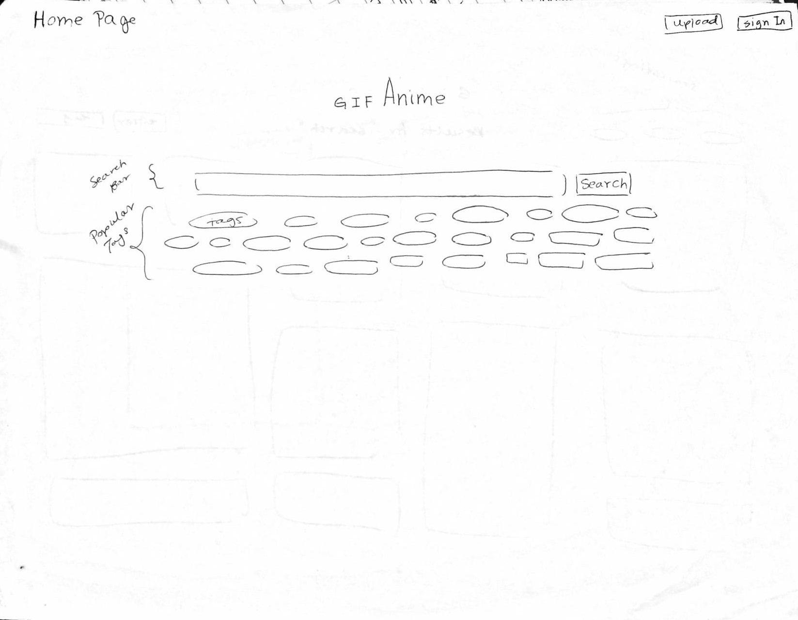
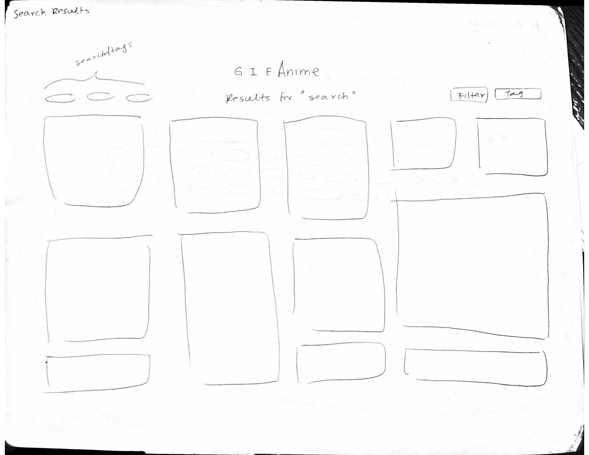
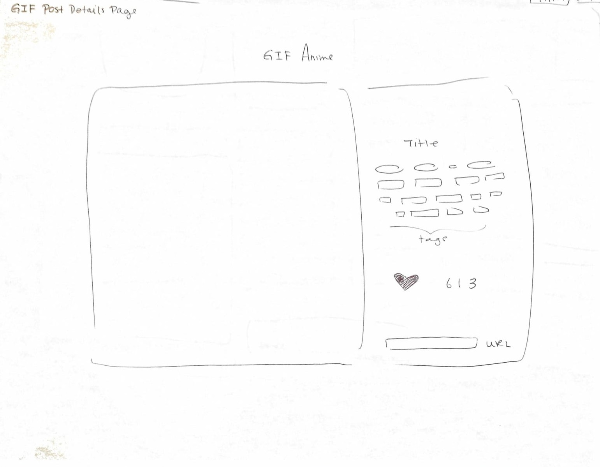
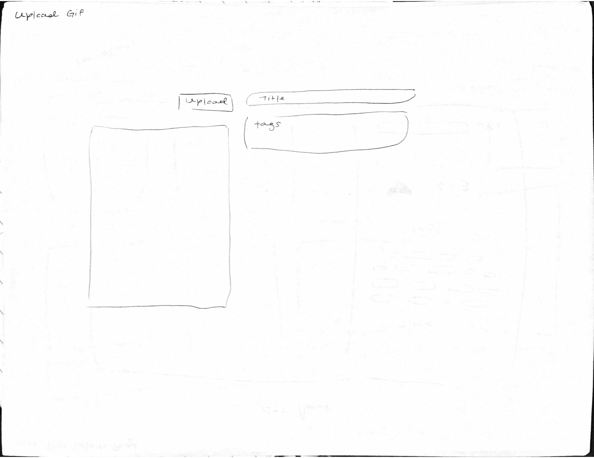
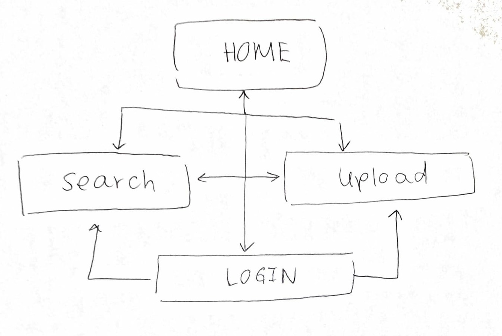

This project is an anime gif database that displays different anime gifs from a variety of different shows. The database will mainly be filtered by show and then, can be further filtered with different popular gif categories using emotions or popular actions (e.g. happy, sad, embarassed, hello, thank you).

Users will be able to search the database for gifs using predesignated filters or using a search bar. This will search through the existing database of gif information which will include titles, captions, and tags. Each gif will have one title, one caption, and at least one tag. 

Users will also be able to upload gifs that will be added into the database and administrators can delete gifs. Potentially, the database will also be populated by using a web crawler.  

Requirements

- Each document inside the database will consist of ImagePosts.
- Schema for a Date, Time, and gif should be...
- var Date = new Schema ({
	year: Number,
	month: Number,
	day: Number
})

- var Time = new Schema ({
	hour: Number,
	minute: Number
})

- var gif = new Schema ({
	title: String,
	tag: [String],
	url: String,
	date: Date,
	time: Time
})

- The gif document will be a post of a gif including the gif itself, title, caption, and related tags. In addition to the post, there will be a date and time attached to the post. 

Wireframes

- Home Screen

- Search Screen

- Post Details Screen

- Upload Screen

Site Map

Webiste Function
- Example Use Case 1 - As someone who uses a lot of GIFS and likes anime, I want multiple GIF images from specific anime shows, so that I can have a matching theme of gifs in my presentation, emails, tumblr posts, etc. So, let me go to gifanime's website and find an anime gif! I really want a Naruto gif, so let me search "naruto" or click on the super popular "naruto" tag. Wow! Look at all the naruto gifs I can choose from and use for my email. 
- Example Use Case 2 - As someone who makes a lot of anime GIFS, I want to share my gifs with everyone, so people can use them and be happy. So, let me go gifanime's website and post my gifs. I made a lot of Fate/Stay gifs, so let me just name these and attach the tags onto these images. Then, I can upload them onto gifanime and people can use them!

Modules to Use and/or Research
- express
- mongoose
- mongoose-url-slugs
- body-parser
- handlebars
- Web Crawlers 

